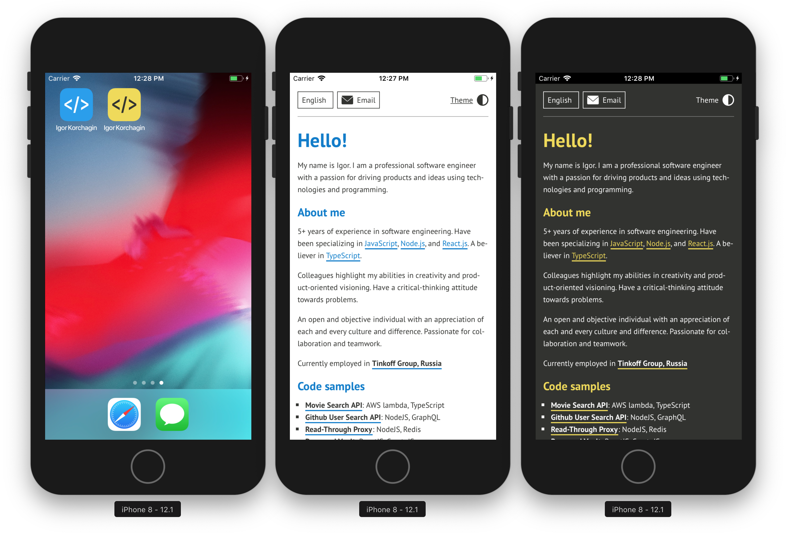
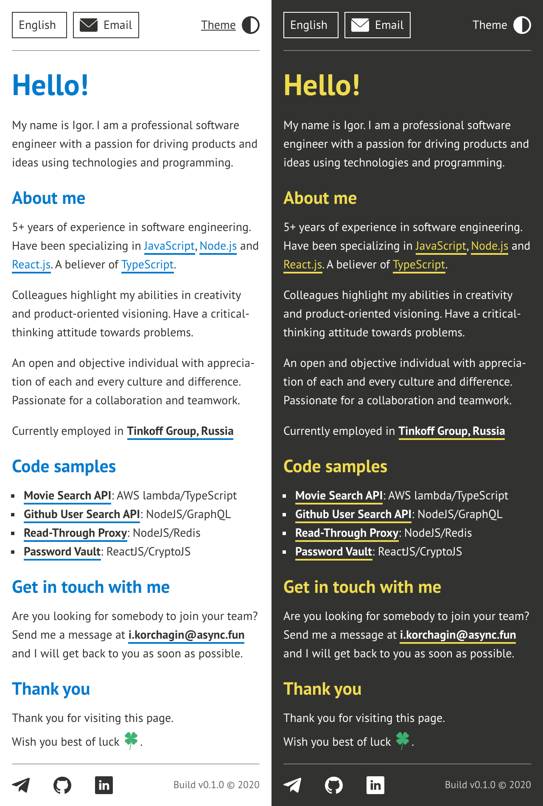

# [Personal GitHub Page](https://async.fun/)

## Theming

The page uses CSS variables for theming and CSS modules for isolating styles.

## Actions

The application supports a query parameter `theme`:

```
https://async.fun?/#/en?theme=light
https://async.fun?/#/en?theme=dark
```

## Internationalization and localization

The application supports language selection based on a route parameter.

```
https://async.fun/#/en
https://async.fun/#/ru
```

## Rich mobile app



## Look and feel



Designed and built with ❤️

## Thank you
