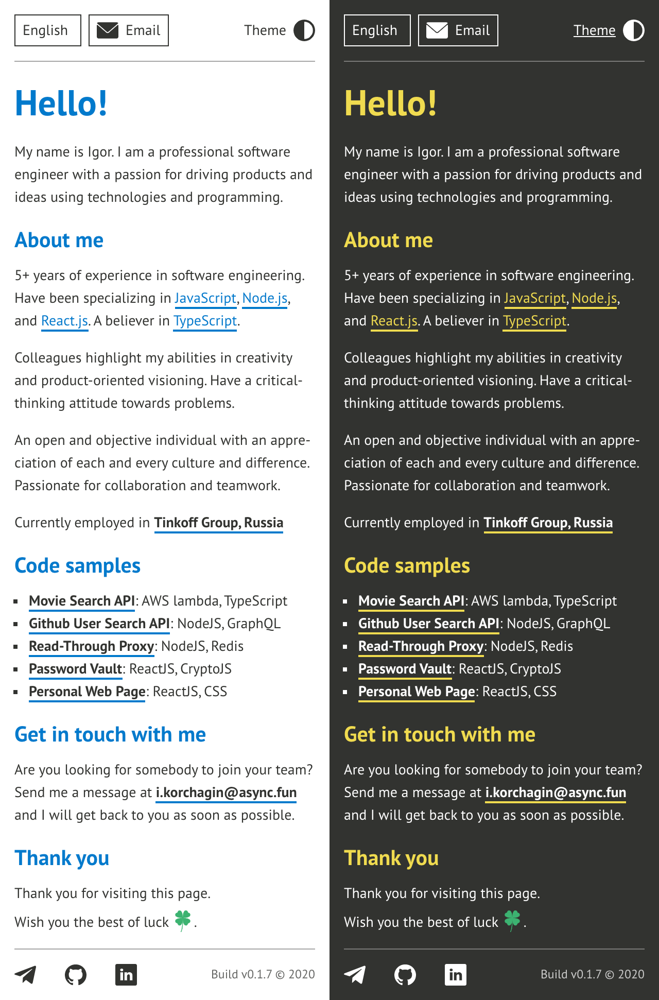

# [Personal GitHub Page](https://igrek8.github.io/)

## Theming

The page uses CSS variables for theming and CSS modules for isolating styles.

## Actions

The application supports a query parameter `theme`:

```
https://igrek8.github.io?/#/en?theme=light
https://igrek8.github.io?/#/en?theme=dark
```

## Internationalization and localization

The application supports language selection based on a route parameter.

```
https://igrek8.github.io/#/en
https://igrek8.github.io/#/ru
```

## Rich mobile app


## Look and feel



Designed and built with ❤️

## Thank you
